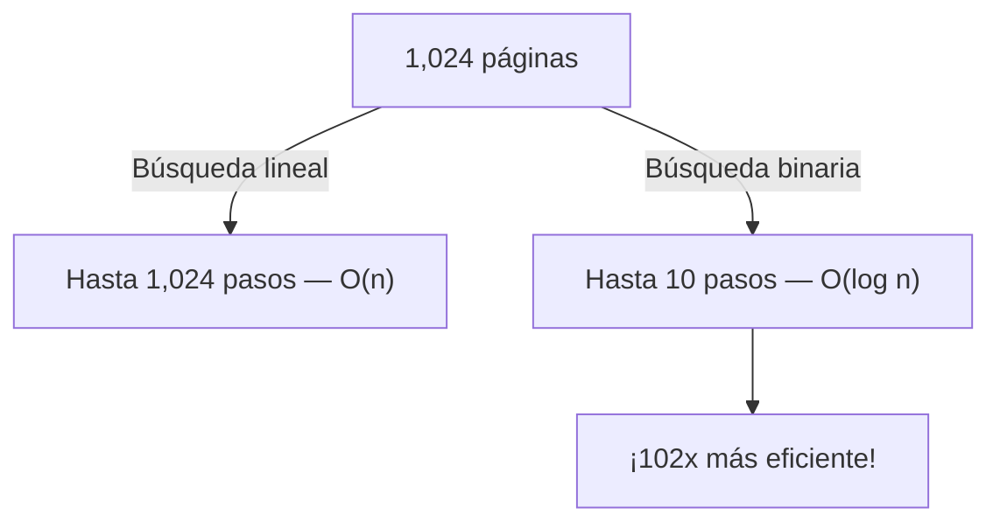

# Clase 0: Pensamiento Computacional y Representación de la Información

Bienvenidos a la Semana 0 de LocalCode (CS50x). Antes de escribir una sola línea de código, necesitamos entender cómo piensa una computadora: cómo representa el mundo con unos y ceros, y cómo diseñamos algoritmos para resolver problemas de forma sistemática.

## Resumen Rápido

- Las computadoras solo entienden electricidad: encendido (`1`) y apagado (`0`)
- Toda la información —números, texto, imágenes, emojis— se codifica en secuencias de `bits`
- 8 `bits` = 1 `byte` = 256 valores posibles (del 0 al 255)
- `ASCII` codifica 128 caracteres del inglés; `Unicode` codifica más de 1 millón de caracteres de todos los idiomas
- Un algoritmo es una secuencia finita, precisa y sin ambigüedad de pasos para resolver un problema
- La búsqueda binaria (O(log n)) es exponencialmente más eficiente que la lineal (O(n)) cuando los datos están ordenados

---

## 1. Pensamiento Computacional

El **pensamiento computacional** es la habilidad de descomponer problemas complejos en partes más pequeñas y resolverlas de forma sistemática. No es exclusivo de los programadores: es una forma de pensar aplicable a cualquier campo.

Sus cuatro pilares son:

| Pilar | Descripción | Ejemplo cotidiano |
|-------|-------------|-------------------|
| **Descomposición** | Dividir el problema en subproblemas más manejables | Para hacer una pizza: masa, salsa, ingredientes, horno — son subproblemas independientes |
| **Reconocimiento de patrones** | Identificar similitudes y regularidades entre problemas | Ordenar números y ordenar nombres usan los mismos algoritmos de comparación |
| **Abstracción** | Ignorar detalles irrelevantes y enfocarse en lo esencial | Manejar un auto sin saber cómo funciona el motor de combustión interna |
| **Algoritmos** | Diseñar pasos concretos, repetibles y sin ambigüedad para resolver el problema | Una receta de cocina: pasos precisos que producen el mismo resultado si se siguen correctamente |

---

## 2. Representación Binaria

Las computadoras son máquinas eléctricas. Un **transistor** puede estar en dos estados: **encendido** (`1`) o **apagado** (`0`). Esto se llama sistema **binario** (base 2).

### De decimal a binario

Cada posición en un número binario representa una potencia de 2:

| Posición | 2⁷  | 2⁶ | 2⁵ | 2⁴ | 2³ | 2² | 2¹ | 2⁰ |
|----------|-----|----|----|----|----|----|----|-----|
| Valor    | 128 | 64 | 32 | 16 | 8  | 4  | 2  | 1   |

**Ejemplo:** ¿Cómo representar el número **72** en binario?

```
72 = 64 + 8 = 01001000
```

| 128 | 64 | 32 | 16 | 8 | 4 | 2 | 1 |
|-----|----|----|----|----|---|---|---|
|  0  |  1 |  0 |  0 | 1 | 0 | 0 | 0 |

### Bits y Bytes

- Un **bit** es la unidad mínima de información: un solo `0` o `1`
- Un **byte** son 8 bits agrupados. Con 8 bits se pueden representar 2⁸ = **256 valores distintos** (del 0 al 255)

```
1 byte  =     8 bits
1 KB    = 1,024 bytes
1 MB    = 1,024 KB
1 GB    = 1,024 MB
```

---

## 3. Representación de Texto: ASCII y Unicode

Los números binarios no solo representan cantidades: también representan caracteres. La pregunta es: ¿qué número le asignamos a cada letra?

### ASCII

`ASCII` (*American Standard Code for Information Interchange*) fue creado en 1963. Asigna un número del 0 al 127 a cada carácter del inglés básico:

| Carácter       | Decimal | Binario      |
|----------------|---------|--------------|
| `A`            | 65      | `01000001`   |
| `B`            | 66      | `01000010`   |
| `a`            | 97      | `01100001`   |
| `0` (dígito)   | 48      | `00110000`   |
| ` ` (espacio)  | 32      | `00100000`   |
| `!`            | 33      | `00100001`   |

**El problema de `ASCII`:** solo cubre el inglés. No tiene `ñ`, `á`, `ü`, caracteres chinos, emojis...

### Unicode

`Unicode` es el estándar moderno que unifica todos los sistemas de escritura del mundo en una sola tabla. Define **puntos de código** (`code points`) para más de 1.1 millones de caracteres.

La codificación más común es `UTF-8`, que usa entre 1 y 4 bytes por carácter y es compatible con `ASCII` para los primeros 128 caracteres:

```
'H'  → U+0048  → 1 byte  → 01001000
'ñ'  → U+00F1  → 2 bytes → 11000011 10110001
'😀' → U+1F600 → 4 bytes → 11110000 10011111 10011000 10000000
```

### Emojis y Modificadores de Tono de Piel

Los emojis son caracteres `Unicode` como cualquier otro. Para los modificadores de tono de piel, `Unicode` usa un segundo carácter que se combina con el emoji base:

```
👋  = U+1F44B (mano, tono predeterminado)
👋🏽 = U+1F44B + U+1F3FD (mano + modificador tono medio)
```

Esto es más eficiente que tener 5 emojis distintos: se usan 2 puntos de código en lugar de 5 conjuntos completos.

---

## 4. Algoritmos

Un **algoritmo** es una secuencia finita, precisa y sin ambigüedad de pasos para resolver un problema. Sus tres propiedades esenciales son: **correcto** (produce la respuesta adecuada para toda entrada válida), **finito** (siempre termina) y **eficiente** (usa los recursos de forma razonable).

### Búsqueda lineal vs búsqueda binaria

Imagina una guía telefónica con 1,024 páginas ordenadas alfabéticamente. Buscas el nombre "Valentina Zurita":

**Búsqueda lineal:** Revisas página 1, no está. Página 2, no está... En el peor caso: **1,024 pasos**.

**Búsqueda binaria:** Abres la página 512 (mitad del libro). "Zurita" está después. Descartas las primeras 512 páginas y abres la página 768... En el peor caso: **10 pasos** (log₂ 1024 = 10).



| Algoritmo         | Notación | n = 1,024 | n = 1,000,000 |
|-------------------|----------|-----------|---------------|
| Búsqueda lineal   | O(n)     | 1,024     | 1,000,000     |
| Búsqueda binaria  | O(log n) | 10        | 20            |

**Condición clave:** la búsqueda binaria solo funciona si los datos están **ordenados**. Esta es la razón por la que ordenar información tiene tanto valor.

### Pseudocódigo

Antes de escribir código, los programadores escriben **pseudocódigo**: una descripción del algoritmo en lenguaje humano estructurado, sin preocuparse por la sintaxis de ningún lenguaje.

```
Abrir guía telefónica por la mitad
Si el nombre buscado está en esa página:
    Encontrado — terminar
Si el nombre buscado está antes de esa página:
    Descartar la mitad derecha y repetir con la mitad izquierda
Si el nombre buscado está después de esa página:
    Descartar la mitad izquierda y repetir con la mitad derecha
```

Este pseudocódigo describe exactamente la búsqueda binaria. Nótese que el algoritmo se llama a sí mismo de forma recursiva: aplica la misma lógica sobre una mitad más pequeña del problema en cada paso.
