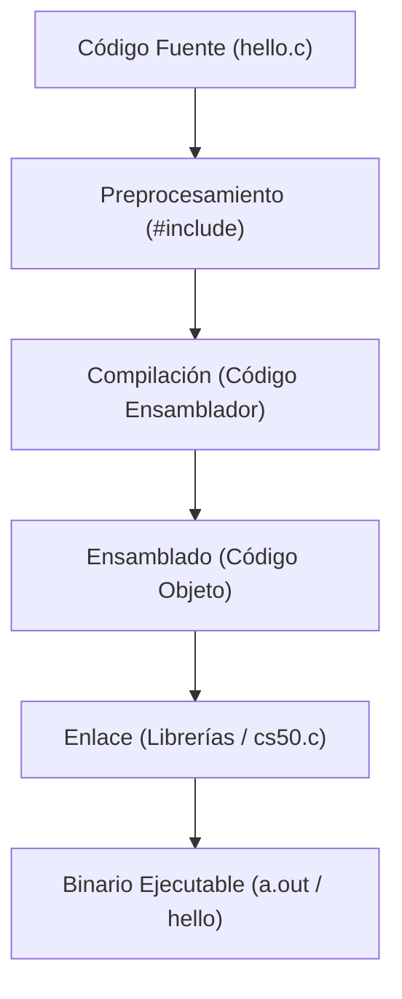

# Clase 1: C y Fundamentos de Programación

Bienvenidos a la Semana 1 de LocalCode (CS50x). En esta lección nos adentraremos en el lenguaje de programación **C**, uno de los lenguajes más influyentes, rápidos y fundamentales de la informática.

---

## 1. El Camino de la Compilación

Cuando escribes un programa en C (por ejemplo, `hello.c`), estás escribiendo **código fuente** (texto legible por humanos). Sin embargo, el microprocesador de tu computadora solo entiende **código máquina** (secuencias de ceros y unos: `010101...`).

El proceso que transforma tu archivo de texto `.c` en un ejecutable binario se llama **Compilación**, y consta de 4 fases principales:



1. **Preprocesamiento:** El compilador busca líneas que comienzan con `#` (como `#include <stdio.h>`) e inyecta el código cabecera correspondiente.
2. **Compilación:** Traduce el código de C al lenguaje intermedio llamado **Ensamblador** (específico para cada arquitectura de CPU).
3. **Ensamblado:** Traduce el código ensamblador a **Código Objeto** (instrucciones binarias sin enlazar).
4. **Enlace (Linking):** Combina el código objeto de tu archivo con las librerías externas enlazadas (como la librería estándar o `cs50.c`). El resultado es el archivo binario ejecutable final.

---

## 2. Tipos de Datos Fundamentales en C

En C, debes indicarle explícitamente a la computadora qué tipo de dato almacena cada variable. Los tipos básicos son:

| Tipo | Bytes | Rango Común / Descripción | Formateador |
|------|-------|---------------------------|-------------|
| `int` | 4 | Números enteros (`-2,147,483,648` a `2,147,483,647`) | `%i` o `%d` |
| `char` | 1 | Un único carácter ASCII (`'A'`, `'b'`, `'9'`) | `%c` |
| `float` | 4 | Números decimales simples (aprox. 7 dígitos decimales) | `%f` |
| `double`| 8 | Decimales de doble precisión (aprox. 15 dígitos) | `%lf` |
| `long` | 8 | Enteros muy grandes | `%li` |

### Ejemplo de Declaración de Variables:
```c
#include <stdio.h>

int main(void)
{
    int edad = 20;
    float pi = 3.14159;
    char inicial = 'D';

    printf("Mi inicial es %c, tengo %d años y pi es %.2f\n", inicial, edad, pi);
}
```

---

## 3. Condicionales y Bifurcaciones

Los condicionales nos permiten tomar decisiones dentro del código basándonos en condiciones lógicas.

```c
if (edad >= 18)
{
    printf("Eres mayor de edad.\n");
}
else if (edad > 12)
{
    printf("Eres adolescente.\n");
}
else
{
    printf("Eres niño.\n");
}
```

---

## 4. Bucles y Ciclos (Loops)

Para repetir tareas repetitivas, C provee varias estructuras de bucles:

### Bucle `while`
Se usa cuando no sabes exactamente cuántas veces vas a iterar, sino que dependes de una condición.
```c
int i = 0;
while (i < 3)
{
    printf("miau\n");
    i++;
}
```

### Bucle `for`
Ideal para iterar un número conocido de veces. Agrupa la inicialización, la condición y la actualización.
```c
for (int i = 0; i < 3; i++)
{
    printf("miau\n");
}
```

---

## 5. Constantes con `const`

Cuando un valor no debe cambiar durante la ejecución del programa, se declara con la palabra clave `const`. Esto tiene dos beneficios: el compilador rechaza cualquier intento de modificarlo, y comunica la intención al lector del código.

```c
#include <stdio.h>

int main(void)
{
    const float PI = 3.14159;
    int radio = 5;

    printf("Área: %.2f\n", PI * radio * radio);

    // PI = 3.0;  ← Error de compilación: assignment of read-only variable 'PI'
}
```

Por convención, las constantes se escriben en `MAYÚSCULAS_CON_GUIONES_BAJOS` para distinguirlas visualmente de las variables.

---

## 6. Conversión de Tipos (Type Casting)

En C, cuando mezclas tipos numéricos en una operación, el compilador aplica **conversión implícita**: promueve el tipo "menor" al tipo "mayor". Sin embargo, la división entre dos `int` siempre produce un `int` (el decimal se trunca), lo que puede causar errores silenciosos.

### División entera vs. división real

```c
int a = 7, b = 2;

// División entera: trunca el resultado
printf("%d\n",   a / b);        // Imprime: 3  (no 3.5)

// División real: al menos un operando debe ser float
printf("%.1f\n", (float) a / b); // Imprime: 3.5
```

### Conversión explícita con cast

La sintaxis `(tipo) expresión` fuerza la conversión antes de la operación:

```c
int x = 7, y = 2;
float resultado = (float) x / y;  // 3.5 — correcto
float malo      = (float)(x / y); // 3.0 — incorrecto: la división ocurre ANTES del cast
```

### Tabla de reglas de promoción en C

| Operandos             | Resultado    |
|-----------------------|--------------|
| `int` ÷ `int`        | `int` (trunca) |
| `int` ÷ `float`      | `float`      |
| `float` ÷ `float`    | `float`      |
| `int` → `(float) int`| `float`      |

### Truncación explícita

El cast también sirve para descartar decimales intencionalmente:

```c
float precio = 3.99;
int entero = (int) precio;  // entero = 3 (trunca, NO redondea)
```
